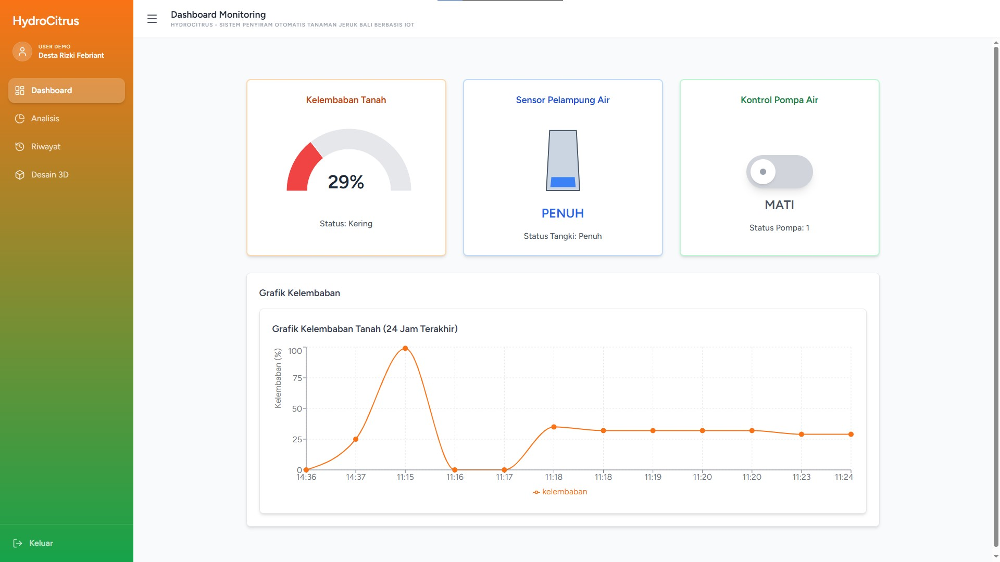
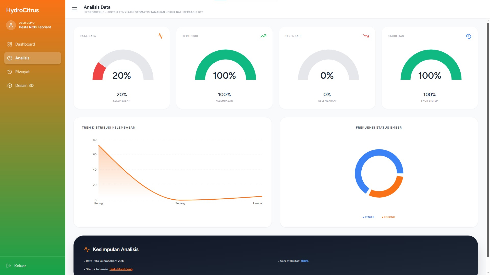
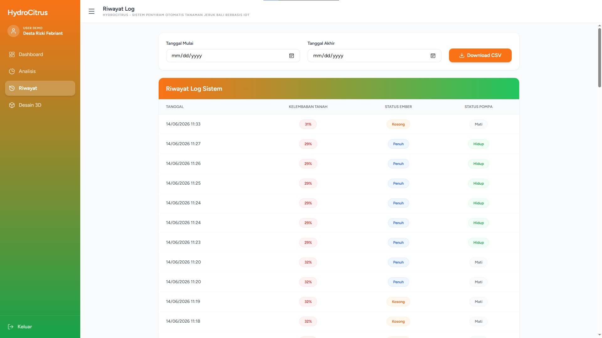

<h1><b>HydroCitrus</b></h1>

Sistem penyiram otomatis dan monitoring kelembaban tanaman jeruk bali berbasis IoT.

Proyek tugas kuliah untuk membuat sistem irigasi otomatis yang bisa dipantau langsung lewat web dashboard. Pompa bekerja otomatis saat tanah kering dan bisa dikontrol manual dari web.

---

## Preview

### 1. Dashboard
Monitoring kelembaban tanah, status air di ember, dan kontrol manual pompa air.

### 2. Analisis Data
Grafik tren kelembaban 24 jam terakhir dan ringkasan statistik kelembaban tanah.

### 3. Model 3D dan Hardware
Visualisasi penempatan komponen pada pot tanaman dan daftar modul yang digunakan.

### 4. Riwayat Log
Tabel catatan riwayat data sensor per waktu dan tombol unduh file CSV.

---

## Hardware yang Digunakan

- Microcontroller: ESP32-S3 DevKitC1 N16R8
- Sensor Kelembaban: Resistive Soil Moisture Sensor
- Sensor Level Air: Water Float Switch
- Pompa: Water Pump 5V dan Modul Relay

---

## Kontributor

- https://github.com/DestinyD423
- https://github.com/Aztecz-Superline

## License

The Laravel framework is open-sourced software licensed under the [MIT license](https://opensource.org/licenses/MIT).

